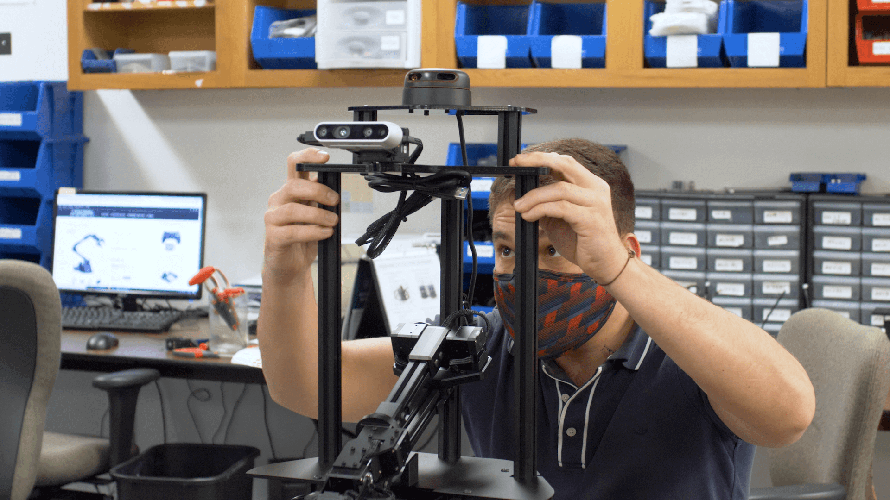
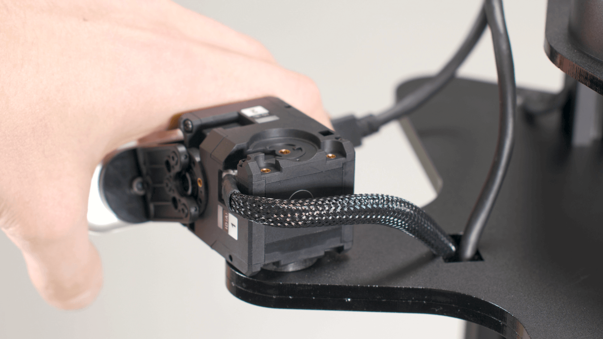
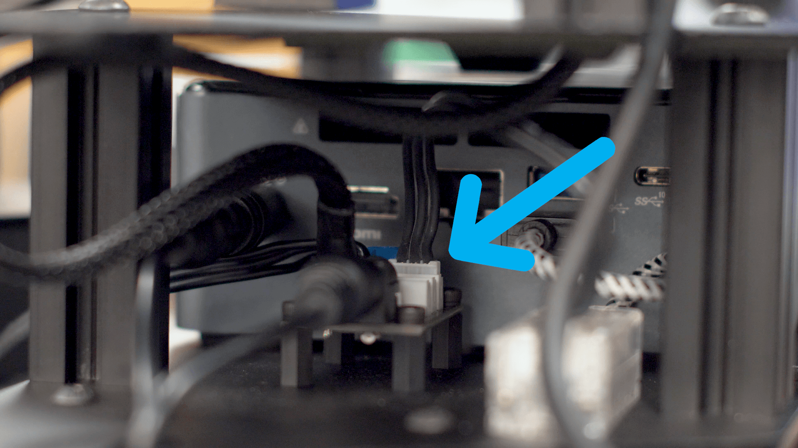

==============
Hardware Setup
==============

Assembly
--------

This tutorial guides you through the process of unboxing and assembling your X-Series LoCoBot
hardware.

.. image:: images/hardware_layout.png
    :align: center
    :width: 70%

1.  If using the Create® 3 base version, the Ethernet cable from the its board must be plugged into the computer.
    Untape the cable from the base, feed it through the slot on the cover plate, through the rear of the robot, and plug it into the computer.

.. container:: no-table

    .. list-table::
        :widths: 25 25 25 25

        * - .. image:: images/create3_ethernet_untape.png
                :width: 100%
          - .. image:: images/create3_ethernet_through_base.png
                :width: 100%
          - .. image:: images/create3_ethernet_through_rear.png
                :width: 100%
          - .. image:: images/create3_ethernet_nuc.png
                :width: 100%

2.  Grab the base of your LoCoBot, the second largest Allen key provided, three M5x12mm screws, and the three black extruded aluminum bars.

.. container:: no-table

    .. list-table::
        :widths: 25 25 25 25

        * - .. image:: images/holding_locobot_base.png
                :width: 100%
          - .. image:: images/holding_allenwrenches.png
                :width: 100%
          - .. image:: images/holding_screws.png
                :width: 100%
          - .. image:: images/holding_bars.png
                :width: 100%

3.  Find the three holes on the back of the base plate and begin screwing in the aluminum bars.
    Make sure to leave a bit of slack to allow for easy assembly of the sensor tower in the next step.

.. container:: no-table

    .. list-table::
        :widths: 33 33 33

        * - .. image:: images/install_bar_one.png
                :width: 100%
          - .. image:: images/install_bar_two.png
                :width: 100%
          - .. image:: images/install_bar_three.png
                :width: 100%

4.  Once all three bars are secured, grab the sensor tower.

5.  Make sure you're aware of the three slots on the bottom of the sensor tower base.

6.  Place the sensor tower on top of the three aluminum bars.

7.  Using three more M5x12mm screws, secure the sensor tower to the aluminum bars.
    Make sure to tighten the screws in the base as well.

.. container:: no-table

    .. list-table::
        :widths: 33 33 33

        * - .. image:: images/sensor_tower_screw_one.png
                :width: 100%
          - .. image:: images/sensor_tower_screw_two.png
                :width: 100%
          - .. image:: images/sensor_tower_screw_three.png
                :width: 100%

8.  If you bought the lidar package, cut the tie holding its USB cables.

9.  Grab two of the cable clips.

.. image:: images/brackets.png
    :align: center
    :width: 70%

10. Run the cable down the front channel on the top right aluminum bar.
    Clip the cable to the front of the bar.

.. image:: images/bracket_top_sensor_tower.png
    :align: center
    :width: 70%

11. Continue running the cable down the back channel of the right aluminum bar.
    Clip the USB adapter to the middle of the bar and the rest of the cable to the bottom of the bar.

.. image:: images/wire_down_bar.png
    :align: center
    :width: 70%

12. Note the difference between the power cable (left) and the data cable (right).

13. Take the lidar's data cable and insert it into the USB port on the right side of the NUC.

.. image:: images/nuc_cables.png
    :align: center
    :width: 70%

14. Wrap the lidar's thinner power cable around the back of the LoCoBot's base and insert it into the 2.1A port on the left side of the battery.

.. container:: no-table

    .. list-table::
        :widths: 50 50

        * - .. image:: images/wrap_cable_around.png
                :width: 100%
          - .. image:: images/power_bank_cables.png
                :width: 100%

15. Run the two depth camera cables down the left aluminum bar.

16. Make sure to leave enough slack in the cable for the camera servo's full range of motion.

17. The braided servo cable goes down the inside channel and down through the inside tower base cutout.

18. The USB cable goes down the back channel and through the back tower base cutout.

.. container:: no-table

    .. list-table::
        :widths: 50 50

        * - .. image:: images/usb_back_tower_slot.png
                :width: 100%
          - .. image:: images/usb_cable_back_channel.png
                :width: 100%

19. Use four clips to secure the cables.

.. container:: no-table

    .. list-table::
        :widths: 50 50

        * - .. image:: images/bracket_placement_upper.png
                :width: 100%
          - .. image:: images/bracket_placement_lower.png
                :width: 100%

20. Take the braided servo cable and insert it into any of the open ports on the power hub located on the left side of the LoCoBot.

21. Insert the depth camera USB cable into the left side of the NUC located next to the power hub.

.. image:: images/depth_camera_into_nuc.png
    :align: center
    :width: 70%

22. Your LoCoBot is now fully assembled. You can proceed to the :doc:`Basic Usage Guide <./user_guide>`, or the :doc:`ROS Interface Guides <../ros_interface>`.

Video Tutorials
===============

LoCoBot Hardware Setup
~~~~~~~~~~~~~~~~~~~~~~

.. container:: no-table

    .. list-table::
        :widths: 50 50
        :align: center

        * - .. youtube:: PQxgWxqFeZg
                :align: center

          - .. youtube:: j9iMogflXLA
                :align: center

        * - **Kobuki Base Version**
          - **Create® 3 Base Version**
