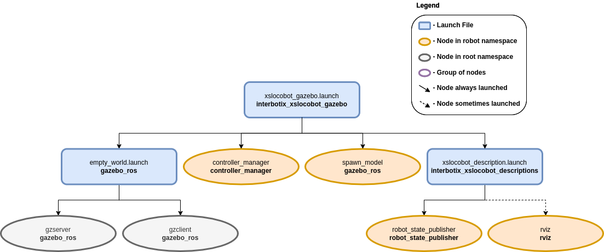

===============================
Gazebo Simulation Configuration
===============================

.. raw:: html

    <a href="https://github.com/Interbotix/interbotix_ros_rovers/tree/main/interbotix_ros_xslocobots/interbotix_xslocobot_gazebo"
        class="docs-view-on-github-button"
        target="_blank">
        
        View Package on GitHub
    </a>

Overview
========

This package contains the necessary config files to get any rover in our X-Series Interbotix
LoCoBot Family simulated in Gazebo. Specifically, it contains the `locobot_configs.gazebo`_ file
which allows the black texture of the robot to display properly (following `this method`_) and
starts various plugins. It also contains YAML files with tuned PID gains for the arm, gripper, and
pan/tilt joints so that ros_control can control the robot effectively. This package can either be
used in conjunction with MoveIt via the FollowJointTrajectory interface or by itself via the
JointPositionController interface.

.. _`locobot_configs.gazebo`: https://github.com/Interbotix/interbotix_ros_rovers/blob/main/interbotix_ros_xslocobots/interbotix_xslocobot_gazebo/config/locobot_configs.gazebo
.. _`this method`: http://answers.gazebosim.org/question/16280/how-to-use-custom-textures-on-urdf-models-in-gazebo/

Structure
=========

As shown above, the `interbotix_xslocobot_gazebo` package builds on top of the
`interbotix_xslocobot_descriptions` and `gazebo_ros` packages. To get familiar with the nodes in
the `interbotix_xslocobot_descriptions` package, please look at its README. The other nodes are
described below:

-   **gzserver** - responsible for running the physics update-loop and sensor data generation
-   **gzclient** - provides a nice GUI to visualize the robot simulation
-   **controller_manager** - responsible for loading and starting a set of controllers at once, as
    well as automatically stopping and unloading those same controllers
-   **spawn_model** - adds the robot model as defined in the 'robot_description' parameter into the
    Gazebo world

Note that the arm joints can be sent trajectories from MoveIt as they use the
`JointTrajectoryController`_ ros_control interface or positions using the
`JointPositionController`_ interface. However, the pan/tilt joints operate via the
JointPositionController interface only. To control them, publish position commands directly to the
appropriate topics (ex. ``/<robot_name>/pan_controller/command`` for the 'pan' joint).

.. _`JointTrajectoryController`: http://wiki.ros.org/joint_trajectory_controller
.. _`JointPositionController`: http://wiki.ros.org/ros_control

Usage
=====

To run this package, type the line below in a terminal (assuming the locobot_wx250s is being
launched with the lidar attached and using trajectory controllers for the arm).

.. code-block:: console

    $ roslaunch interbotix_xslocobot_gazebo xslocobot_gazebo.launch robot_model:=locobot_wx250s show_lidar:=true use_trajectory_controllers:=true

Since by default, Gazebo is started in a 'paused' state (this is done to give time for the
controllers to kick in), unpause the physics once it is fully loaded by typing:

.. code-block:: console

    $ rosservice call /gazebo/unpause_physics

This is the bare minimum needed to get up and running. Take a look at the table below to see how to
further customize with other launch file arguments.

.. csv-table::
    :file: ../_data/gazebo_simulation_configuration.csv
    :widths: 20 60 20
    :header-rows: 1

.. _`xslocobot_description.launch`: https://github.com/Interbotix/interbotix_ros_rovers/blob/main/interbotix_ros_xslocobots/interbotix_xslocobot_descriptions/launch/xslocobot_description.launch
.. _`xslocobot_gazebo.launch`: https://github.com/Interbotix/interbotix_ros_rovers/blob/main/interbotix_ros_xslocobots/interbotix_xslocobot_gazebo/launch/xslocobot_gazebo.launch
