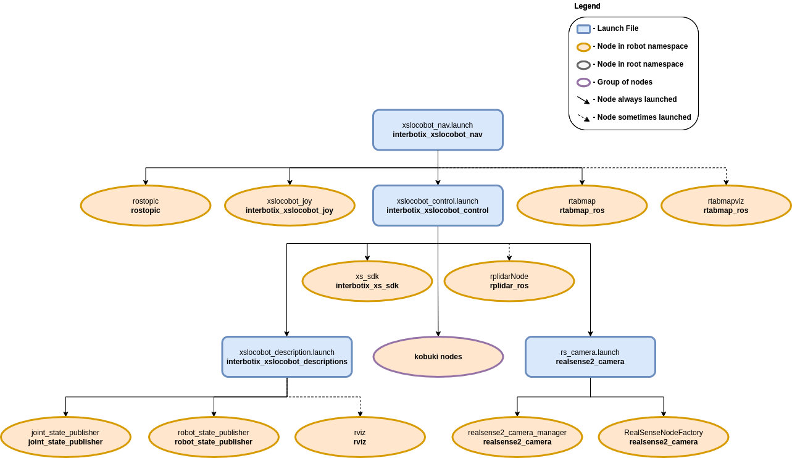
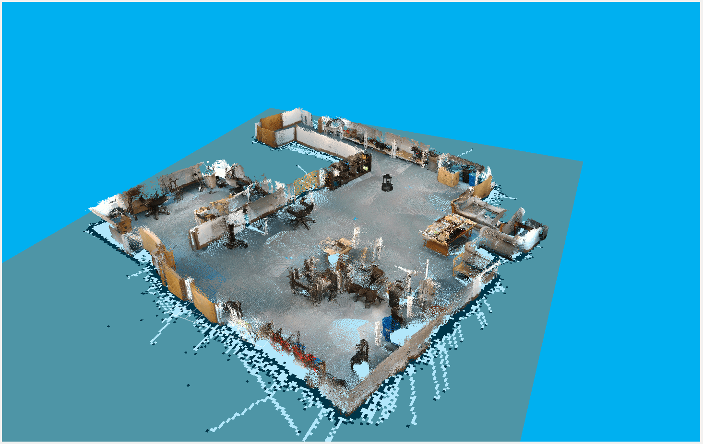
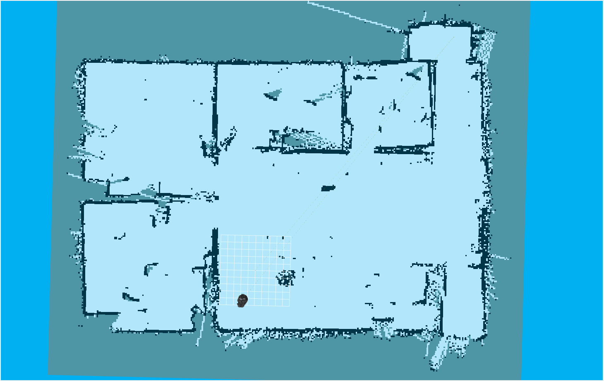
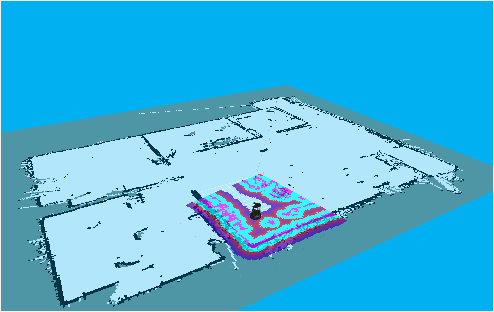
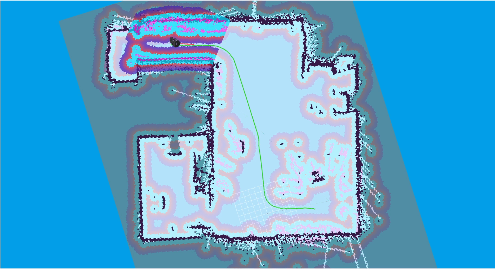

==============================
Navigation Stack Configuration
==============================

.. raw:: html

    <a href="https://github.com/Interbotix/interbotix_ros_rovers/tree/main/interbotix_ros_xslocobots/interbotix_xslocobot_nav"
        class="docs-view-on-github-button"
        target="_blank">
        
        View Package on GitHub
    </a>

Overview
========

This package configures the ROS Navigation Stack needed to give any X-Series Interbotix LoCoBot
platform the ability to perform simultaneous localization and mapping (SLAM), navigation, or just
localization. It can be used with just the `Intel RealSense D435`_ camera or with both the camera
and the `A2 RPLidar`_ laser scanner. The localization and mapping part is done using the
`rtabmap_ros`_ ROS package while the navigation part is accomplished via the `move_base`_ ROS
package.

.. note::

    For best results, this package should be run with the robot in an indoor, uncluttered
    environment that does not contain too much sunlight and has minimal reflective surfaces.

.. _`Intel RealSense D435`: https://www.intelrealsense.com/depth-camera-d435/
.. _`A2 RPLidar`: https://www.slamtec.com/en/Lidar/A2
.. _`rtabmap_ros`: http://wiki.ros.org/rtabmap_ros
.. _`move_base`: http://wiki.ros.org/move_base

Structure
=========

As shown above, this package builds on top of the `interbotix_xslocobot_control` package (which
starts the **xs_sdk** node), and is used in conjunction with the `rtabmap_ros` and `move_base` ROS
packages. A short description of the nodes needed from those packages can be found below:

-   **rostopic** - used to publish the desired tilt angle for the RealSense camera at startup
-   **rtabmapviz** - Rtabmap's Visualization tool when doing mapping or localization; not really
    necessary to use since Rtabmap has RViz plugins that work pretty well
-   **move_base** - responsible for planning paths for the robot and sending Twist commands to the
    base to follow them
-   **rtabmap** - responsible for performing SLAM or just localization

Note that there are also a few Rtabmap nodelets that are started up under the
`realsense2_camera_manager` for processing purposes. Descriptions of them are below:

-   **rtabmap_ros/rgbd_sync** - synchronizes color and depth images from the Realsense camera, and
    outputs an RGBD image; this is used by the nodelet below and the main **rtabmap** node to do
    SLAM or localization
-   **rtabmap_ros/point_cloud_xyzrgb** - takes in RGBD images, decimates them (to reduce noise and
    processing requirements), and outputs PointCloud2 messages to the nodelet below
-   **rtabmap_ros/obstacles_detection** - takes in PointCloud2 messages and filters out the ground;
    then it outputs the resulting PointCloud2 to ``depth/color/obstacles``. This is in turn used by
    `move_base` to avoid obstacles

Usage
=====

There are three ways this package can be used:

1.  `SLAM From Scratch`_
2.  `Continuing SLAM From a Pre-Built Map`_
3.  `Localization`_

.. note::

    The commands below assume the user has a LoCoBot WidowX 200 robot with the lidar add-on.
    However, any X-Series LoCoBot will work. If no lidar is being used, make sure the ``use_lidar``
    argument is set to ``false``.

.. _`interbotix-xslocobot-nav-slam-from-scratch-label`:

SLAM From Scratch
-----------------

To get SLAM up and running from scratch, type the following in a terminal on the robot computer:

.. code-block:: console

    $ roslaunch interbotix_xslocobot_nav xslocobot_nav.launch robot_model:=locobot_wx200 use_lidar:=true rtabmap_args:=-d

In the above command, the argument ``rtabmap_args:=-d`` is provided. This will delete the current
database (by default - stored at ``~/.ros/rtabmap.db``) and create a new one. The database stores
map cloud and graph data (see the ROS Wiki for info on these concepts) which it then uses at run
time to create a 2D map that `move_base` can use.

Once the Nav Stack is running, you should see info messages appearing in the terminal once a second
saying something similar to...

.. code-block:: console

    rtabmap (3): Rate=1.00s, Limit=0.000s, RTAB-Map=0.0697s, Maps update=0.0099s pub=0.0000s (local map=1, WM=1)

Now, to visualize the robot in RViz, run the following on your remote Linux computer (note that you
should first run the :ref:`remote installation <ros-software-setup-remote-install-label>` script on
your personal computer if you haven't done so already).

.. code-block:: console

    $ roslaunch interbotix_xslocobot_descriptions remote_view.launch rviz_frame:=map

RViz should now open up looking like the picture below:

.. image:: images/rviz_start.png
    :align: center
    :width: 70%

To visualize the map being created, click the checkbox by the **Map** display. To see a live color
feed as well as filtered point cloud data from the RealSense camera, click the **Camera** display.
The `move_base` package uses this filtered point cloud data to detect obstacles in the robot's
path. It is filtered to reduce bandwidth and to segment out the floor so that the robot doesn't
think the 'floor is lava' so-to-speak. On the other hand, `rtabmap_ros` uses both the live feed and
an aligned depth feed (not displayed) to perform mapping and localization. Next, click the
**LaserScan** display to show a 360 degree view of where it thinks there are obstacles. This is
used both by `move_base` for obstacle detection and `rtabmap_ros` for mapping and localization
refinement. Moving on, the **RtabmapRos** display can be used to show a point-cloud representation
of the robot's environment built in real-time as the robot moves. See the picture below for a
visualization of all these displays in RViz.

.. image:: images/map_building.png
    :align: center
    :width: 70%

At this point, you're ready to start moving the robot. There are three ways to do this. One is to
use the **2D Nav Goal** button at the the top of the RViz screen to set a goal pose within the
map's free space. This sends a command to `move_base` to plan out and execute a path to the goal. A
second way is to run the ``xslocobot_joy.launch`` file found in the `interbotix_xslocobot_joy` ROS
package (either on the robot or on your remote computer). To do this, type...

.. code-block:: console

    $ roslaunch interbotix_xslocobot_joy xslocobot_joy.launch robot_model:=locobot_wx200 launch_driver:=false

Setting the ``launch_driver`` argument to ``false`` tells the launch file not to startup the
locobot driver nodes as the robot is already running. Finally, a third way to move the robot is to
run the Kobuki **keyop** node (if using the Kobuki version). This will then allow you to use your
keyboard arrow keys to move the robot. To do this, type the following either on the robot or remote
computer...

.. code-block:: console

    $ roslaunch kobuki_keyop keyop.launch __ns:=locobot

Note the two underscores before the ``ns`` launch file tag. Also note that **only one** of these
control modes should be used at a time; otherwise, the base might not move correctly (as it's being
bombarded with different velocity commands from multiple packages simultaneously).

We recommend using a PS4 controller when doing mapping or SLAM since that gives you full control on
the robot's motion and is more intuitive to use than the keyboard. Some other tips to get a clean
point cloud map are:

-   Rotate the robot full circle slowly to get as many features as possible so that the algorithm
    has a higher chance of getting loop closures
-   After rotating in a single spot, slowly translate over to another spot, and do another full
    circle. Repeat this and the above step multiple times until you've mapped your desired area
-   In the **RtabmapROS** RViz display, open up the **MapCloud** display, and raise the ``Cloud
    decimation`` level to 6 or 8 (default is 4). This will filter out more of the raw point cloud
    data, reducing noise
-   Also in the **RtabmapROS** RViz display, open the **MapCloud** display, and lower the ``Cloud
    max depth`` level to 2 (default is 4). This will only stitch point cloud data up to 2 meters
    away from the robot together. As depth readings tends to degrade the further away they are from
    the sensor, this will also filter out noisy data.
-   Try not to map out areas that are already mapped out more than once to reduce noise; also this
    will keep the size of the resulting database smaller; these files can be rather large (a few
    hundred Megabytes)
-   For optimal loop closure detection, it's a good idea that the depth camera be tilted to the
    same angle that it will be tilted at when just doing localization; during localization, it's a
    good idea to have the camera tilted down slightly so that small obstacles that can't be seen by
    the laser scanner can be picked up.

After mapping, you should have a MapCloud similar in structure to the one below. If that's the
case, type :kbd:`Ctrl` + :kbd:`C` in the robot's terminal to stop the launch file. Then close out
RViz on your remote computer as well.

Continuing SLAM From a Pre-Built Map
------------------------------------

To continue doing SLAM, type the following in a terminal on the robot computer:

.. code-block:: console

    $ roslaunch interbotix_xslocobot_nav xslocobot_nav.launch robot_model:=locobot_wx200 use_lidar:=true rtabmap_args:='--Rtabmap/StartNewMapOnLoopClosure true'

Setting the ``Rtabmap/StartNewMapOnLoopClosure`` parameter to ``true`` tells Rtabmap to wait on
starting a new map until it detects a loop closure with the old map. If you'd rather have Rtabmap
start creating a new map right away before finding loop closures (perhaps you're mapping a
different part of your office that's not next to the first part), then set the parameter to
``false`` (which it should be by default).

As far as visualizing the robot in RViz and controlling it are concerned, just look at the tips in
the `SLAM From Scratch`_ section above.

Localization
------------

Once you've finished mapping your desired environment, the next step is to have the robot uses its
sensors to just localize itself within the map while navigating. To do so, type the following in a
terminal on the robot computer:

.. code-block:: console

    $ roslaunch interbotix_xslocobot_nav xslocobot_nav.launch robot_model:=locobot_wx200 use_lidar:=true localization:=true

Next, open up RViz on your remote computer as outlined in the `SLAM From Scratch`_ section, and
visualize the **Map** display. You should see something similar in structure to the picture below
(of course your office layout will be different).

Now check the **Move Base** RViz display. This should display both the global and local costmaps.
In general, a costmap associates obstacles with high cost values (100), areas near obstacles with
slightly lower values (from 1 - 99), and free space as 0. These costmaps are then used to do path
planning where the main objective is to find a path with the minimum cost. Check the `ROS Wiki
costmap_2d page`_ for a more detailed description. For the map above (generated from Rtabmap), the
global costmap looks like...

.. _`ROS Wiki costmap_2d page`: http://wiki.ros.org/costmap_2d

.. image:: images/global_costmap.png
    :align: center
    :width: 70%

As can be seen, it's pretty colorful! Each color is associated with a cost. The color that lines up
with the black part in the original map represents true obstacles and signifies the highest cost
(the light purple color surrounded by cyan in this case). As you move outward from the true
obstacle, each color signifies a slightly lower cost.

In this case, the global costmap is made up of three layers. The first one is the static map layer
which is essentially the map created by Rtabmap. The second one is the Obstacle layer. Any
obstacles picked up by the robot's sensors not seen in the original static map are added in this
layer. The final one is the Inflation layer. As its name suggests, all obstacles are inflated a bit
to prevent the robot from navigating too close to obstacles.

The local costmap on the other hand is made up of two layers and is a lot smaller (a 4 meter square
area centered around the robot). It just contains the Obstacle layer and the inflation layer. A
picture of it can be seen below.

Besides for the Costmap sub-displays in the **Move Base** group, there are also the Global and
Local Plan displays. Whenever a 2D Nav Goal is set in RViz, a global path (in green) is displayed
linking the goal state with the start state. This path is the overall path the robot will try to
follow. Similarly, a local plan (in red) is also displayed that starts from the robot's footprint
and goes for about a meter. The local plan attempts to follow the global path but will take detours
if obstacles get in the way.

When starting in localization mode, Rtabmap will try to localize the robot using its last known
position (from a previous session) as a reference point. Most of the time, it's able to figure out
where the robot is. Sometimes however, especially if the room is not feature-rich, Rtabmap will
localize the robot incorrectly. If that's the case, just use the **2D Pose Estimate** tool at the
top of the RViz window to let Rtabmap know where the robot actually is.

This is the bare minimum needed to get up and running. Take a look at the table below to see how to
further customize with other launch file arguments.

.. csv-table::
    :file: ../_data/navigation_stack_configuration.csv
    :header-rows: 1
    :widths: 20 60 20

.. _`xslocobot_nav.launch`: https://github.com/Interbotix/interbotix_ros_rovers/blob/main/interbotix_ros_xslocobots/interbotix_xslocobot_nav/launch/xslocobot_nav.launch

Simulation
----------

To simulate the Navigation Stack in Gazebo, the helper launch file, ``xslocobot_nav_sim.launch``
has been provided. To use it, enter the command below, along with any of the other args mentioned
above that would be relevant to your application. Once Gazebo loads, unpause the physics, and start
your navigation and mapping application.

.. code-block:: console

    $ roslaunch interbotix_xslocobot_nav xslocobot_nav_sim.launch robot_model:=locobot_wx200 dof:=5 use_position_controllers:=true use_lidar:=true

.. note::

    The ``dof`` command must be specified in order to load the proper position controllers.

.. note::

    If you'd like to use the JointTrajectoryController configuration instead of the
    JointPositionController configuration, ``use_trajectory_controllers:=true`` should be set
    instead of ``use_position_controllers:=true``.

Troubleshooting
===============

Time out waiting for transform...
---------------------------------

When starting the Nav Stack (either when continuing a map or just doing localization) on your
robot, you may see some warnings appear in the terminal. For example...

.. code-block:: console

    Timed out waiting for transform from locobot_wx200/base_footprint to map to become available before running costmap, tf error: canTransform: target_frame map does not exist.. canTransform returned after 0.100567 timeout was 0.1

The reason this appears is because no map is being supplied to the navigation stack. The reason for
that is because it takes Rtabmap a few seconds to generate the map from its database (which could
be hundreds of megabytes). As such, this warning can be safely ignored assuming it stops once
Rtabmap gets the map out.

Rejected Loop Closure
---------------------

When starting the Nav stack or during mapping, you may see the following warning appear (or
similar) in the terminal...

.. code-block:: console

    Rtabmap.cpp:2533::process() Rejected loop closure 694 -> 773: Not enough inliers 0/20 (matches=0) between 694 and 772

Similar to the first warning, this can be ignored if it only shows up a few times at node startup.
It just means that Rtabmap has failed to determine where the robot is in the map. If you're mapping
too quickly, this warning can also appear, so slow down a bit.

Robot does not go to same location after map reset
--------------------------------------------------

If Create 3 is used, the robot keeps its odometry through sessions and power cycles. You may need
to use the ROS 2 /<mobile_base>/reset_pose service with each new map to ensure the robot goes to
the same location.

Video Tutorials
===============

SLAM'ing on the LoCoBot
-----------------------

.. youtube:: QpSxw0tvfIo
    :width: 70%
    :align: center

|

In-Depth Look at the LoCoBot Navigation Stack
---------------------------------------------

.. youtube:: hj9XsCkooEk
    :width: 70%
    :align: center
