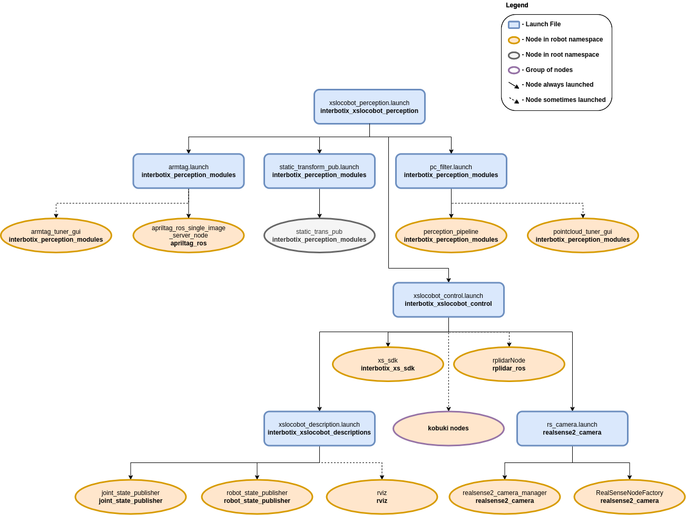
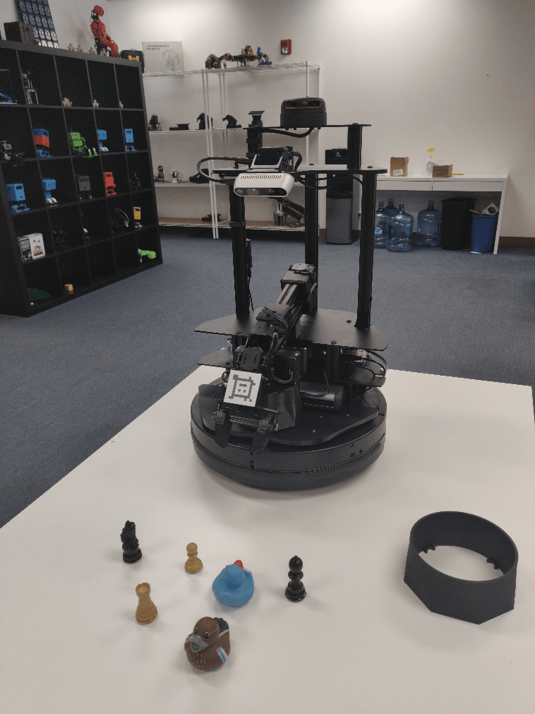
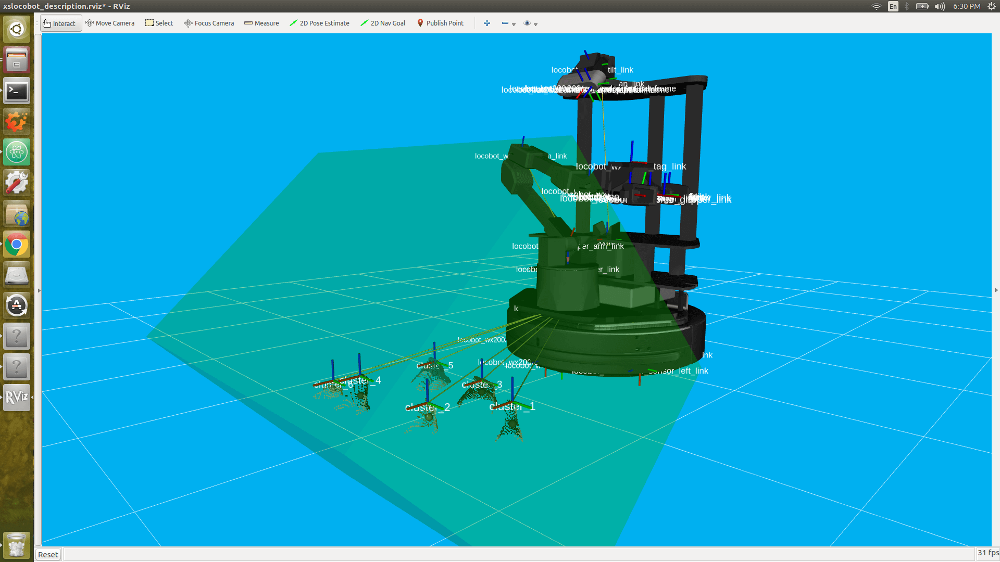

=================================
Perception Pipeline Configuration
=================================

.. raw:: html

    <a href="https://github.com/Interbotix/interbotix_ros_rovers/tree/main/interbotix_ros_xslocobots/interbotix_xslocobot_perception"
        class="docs-view-on-github-button"
        target="_blank">
        
        View Package on GitHub
    </a>

Overview
========

This package contains the necessary config and launch files to get any of the Interbotix X-Series
LoCoBot arms working with the `perception pipeline`_. The end result allows for an arm to pick up
any small, non-reflective object from a tabletop-type surface that is within a RealSense
color/depth camera's field of view. While any Intel RealSense color/depth camera can be used, this
package was mainly tested with the `D435`_ camera. See more details on how the pipeline works in
the `interbotix_perception_modules`_ ROS package.

.. _`perception pipeline`: https://industrial-training-master.readthedocs.io/en/melodic/_source/session5/Building-a-Perception-Pipeline.html
.. _`D435`: https://www.intelrealsense.com/depth-camera-d435/
.. _`interbotix_perception_modules`: https://github.com/Interbotix/interbotix_ros_toolboxes/tree/main/interbotix_perception_toolbox/interbotix_perception_modules

Structure
=========

As shown above, this package builds on top of the `interbotix_xslocobot_control` and
`interbotix_perception_modules` packages. To get familiar with those packages, please refer to
their respective documentation.

Usage
=====

To work with this package, place some small, non-reflective objects on the floor near the mobile
base such that they are clearly visible to the camera (when it's pointed down) and are reachable by
the arm. The objects should be small enough such that they can easily fit between the gripper
fingers on the robot arm no matter the gripper's orientation. They can not be too reflective though
as that will interfere with the depth camera's ability to locate them (as it uses infrared light).
Similarly, the workspace should not be in direct sunlight as that also interferes with the camera's
depth sensing abilities. Otherwise, the small objects can be arbitrarily placed. For the `pick and
place demo`_, you should setup your workspace area as shown below.

.. _`pick and place demo`: https://github.com/Interbotix/interbotix_ros_rovers/blob/main/interbotix_ros_xslocobots/interbotix_xslocobot_perception/scripts/pick_place_no_armtag.py

Now with a standalone arm, two things would normally have to be done. First, the camera would need
to know where the arm is relative to itself. Second, the pointcloud filter parameters would have to
be tuned to 'register' the objects being picked up. However, since the arm and camera in this case
are part of the same robot, this transform is already known from the URDF. So there really is no
need to use the AR tag on the arm to figure out this transform. The tag is mainly there so that if
you decide to remove the arm from the LoCoBot for some other project, you can still use the
perception pipeline.

That said, in case the URDF of the robot platform is not accurate enough for you, the
`apriltag_ros`_ ROS package can be used to find the transform of the AprilTag on the arm's
end-effector (looks like a smiley face) relative to the camera's color optical frame. Following
this, the transform from the `base_link` frame to the `plate_link` frame can be calculated and
published as a static transform such that the `ar_tag_link` frame of the arm matches the position
of where the camera thinks the AprilTag is located.

.. _`apriltag_ros`:

To get that transform, run the following launch command in a terminal (assuming a LoCoBot WidowX
200 arm is being used)...

.. code-block:: console

    $ roslaunch interbotix_xslocobot_perception xslocobot_perception.launch robot_model:=locobot_wx200 use_armtag_tuner_gui:=true use_pointcloud_tuner_gui:=true use_armtag:=true use_static_transform_pub:=true

.. note::

    If you don't want to calibrate using the AR tag, then only set the ``robot_model`` and
    ``use_pointcloud_tuner_gui`` parameters. Afterwards, skip to the `PointCloud Filter Tuning`_
    section below.

ArmTag Calibration
------------------

RViz should pop up along with two standalone GUIs. One of those GUIs will look like the picture
below.

.. image:: images/armtag_tuner_gui.png
    :align: center

Depending on how you setup your arm and camera in your workspace, the AprilTag on the arm may not
be visible to the camera. To make it visible, first torque off all the arm joints by opening a
terminal and typing...

.. code-block:: console

    $ rosservice call /locobot/torque_enable "{cmd_type: 'group', name: 'arm', enable: false}"

Next, manually manipulate the arm such that the AprilTag is clearly visible to the camera (the live
video stream in the bottom left of the RViz display should help with that). Then in the same
terminal as before, torque the arm back on as follows...

.. code-block:: console

    $ rosservice call /locobot/torque_enable "{cmd_type: 'group', name: 'arm', enable: true}"

Now, in the ArmTag Tuner GUI, click the **Snap Pose** button. Feel free to toggle up/down the
number of snapshots that should be taken. The poses calculated from the snapshots will then be
averaged to come up with a more accurate pose of where the arm is relative to the camera. One way
to check the accuracy of the calculated pose is to toggle the **RawPointCloud** display in RViz.
Hopefully, the pointcloud version of the AprilTag should be located on (possibly a couple
millimeters below) the AR tag link of the virtual robot model. If it's not, feel free to keep
pressing the **Snap Pose** button until it looks alright. As an FYI, from experience, it seems the
camera thinks the arm should really be 2-3 mm offset along the plate_link's X and Y axes. However,
this could just be due to how the Apriltag is placed on the arm. It also thinks the plate_link
should be offset upwards on its Z axis by just over 4 mm.

.. _`pointcloud_filter_tuning-label`:

PointCloud Filter Tuning
------------------------

At this point, you should see a pointcloud version of your workspace with the objects on it. If
your arm is in the way, just torque it off and move it to its Sleep pose (make sure to hold the arm
before torquing it off). Then, using the **PointCloud Tuner GUI**, tune the pointcloud parameters
for your specific use case. `Here is a detailed explanation`_ of how to go about doing this. Don't
forget to save your configs after tuning them!

.. _`Here is a detailed explanation`: https://github.com/Interbotix/interbotix_ros_toolboxes/tree/main/interbotix_perception_toolbox/interbotix_perception_modules

Pick and Place Demo
-------------------

Now, you are almost ready to run the `python demo script`_. First make sure to edit the robot model
name in the script to your robot model (if it's not ``locobot_wx200``). Then navigate to the
`pick_place_no_armtag.py`_ script and execute it.

.. _`python demo script`: https://github.com/Interbotix/interbotix_ros_rovers/blob/main/interbotix_ros_xslocobots/interbotix_xslocobot_perception/scripts/pick_place_no_armtag.py
.. _`pick_place_no_armtag.py`: https://github.com/Interbotix/interbotix_ros_rovers/blob/main/interbotix_ros_xslocobots/interbotix_xslocobot_perception/scripts/pick_place_no_armtag.py

.. code-block:: console

    $ python pick_place_no_armtag.py    # python3 pick_place_no_armtag.py if using ROS Noetic

While running the script, you should see a TF marker appear close to the top of each object's
cluster (see the image below for clarification). This is where the camera believes the top of each
cluster to be, and is the position returned to the user from the ``get_cluster_positions``
function. These TFs are temporary and will fade from RViz after a minute is up. The arm will then
line up its ``ee_gripper_link`` to be in the same spot as each of these cluster positions and
hopefully pick up the objects.

After running the demo, :kbd:`Ctrl` + :kbd:`C` from the launch file. The `base_link` to
`plate_link` transform will automatically be saved in a file called 'static_transforms.yaml' in the
`config`_ directory (if you decided to go through the AR tag calibration). Now, you can run the
demo script headless - first by typing...

.. _`config`: https://github.com/Interbotix/interbotix_ros_rovers/blob/main/interbotix_ros_xslocobots/interbotix_xslocobot_perception/config

.. code-block:: console

    $ roslaunch interbotix_xslocobot_perception xslocobot_perception.launch robot_model:=locobot_wx200 use_rviz:=false use_static_transform_pub:=true

Then heading over to the `scripts`_ directory and running the `pick_place_no_armtag.py`_ script.
Note that you can leave the ``use_static_transform_pub`` argument above to its default value
(``false``) if you did not do the AR tag calibration.

.. _`scripts`: https://github.com/Interbotix/interbotix_ros_rovers/blob/main/interbotix_ros_xslocobots/interbotix_xslocobot_perception/scripts

For more info, check out the `Armtag`_ or `Pointcloud`_ Python APIs to reference the fully
documented functions.

.. _`Armtag`: https://github.com/Interbotix/interbotix_ros_toolboxes/tree/main/interbotix_perception_toolbox/interbotix_perception_modules/src/interbotix_perception_modules/armtag.py
.. _`PointCloud`: https://github.com/Interbotix/interbotix_ros_toolboxes/tree/main/interbotix_perception_toolbox/interbotix_perception_modules/src/interbotix_perception_modules/pointcloud.py

Other launch file arguments for further customization can be seen below...

.. csv-table::
    :file: ../_data/perception_pipeline_configuration.csv
    :header-rows: 1
    :widths: 20 60 20

.. _`xslocobot_perception.launch`: https://github.com/Interbotix/interbotix_ros_rovers/blob/main/interbotix_ros_xslocobots/interbotix_xslocobot_perception/launch/xslocobot_perception.launch

Troubleshooting
===============

Below are some common error messages, warnings, or issues you might see, and how to go about fixing
them.

ArmTag Issues
-------------

Could not find AR Tag. Returning a 'zero' Pose...
~~~~~~~~~~~~~~~~~~~~~~~~~~~~~~~~~~~~~~~~~~~~~~~~~

This warning occurs if the camera cannot see the AprilTag or if the wrong AprilTag is present. To
fix, make sure that the AprilTag is clearly visible to the camera when you try to 'snap' its pose.

PointCloud Filter Tuning Issues
-------------------------------

Incomplete bulk usb transfer!
~~~~~~~~~~~~~~~~~~~~~~~~~~~~~

This is just a onetime error message that appears at launch when using the RealSense depth camera
camera. It's nothing to be worried about and can be safely ignored.

No stream match for pointcloud chosen texture Process - Color
~~~~~~~~~~~~~~~~~~~~~~~~~~~~~~~~~~~~~~~~~~~~~~~~~~~~~~~~~~~~~

This is a warning that can appear occasionally (once every 5 minutes or so) when using a RealSense
camera. It just means that a frame was dropped during serial communication, but it's nothing to
worry about and can be safely ignored.

No clusters found...
~~~~~~~~~~~~~~~~~~~~

This warning is outputted by the ``get_cluster_positions`` function in the
InterbotixPointCloudInterface module if the algorithm could not find any clusters. Verify that you
have non-reflective objects within the field of view of the camera and that the CropBox filter is
not cutting them out. To check this, toggle on the 'FilteredPointCloud' display in RViz and see if
the pointcloud representation of your objects are showing up. If they are, it's possible that you
need to lower the minimum cluster size threshold; turn on the 'ObjectPointCloud' and
'ObjectMarkers' displays and lower the Min Cluster Size parameter until you see small spheres at
the centroid of each of your clusters.

Found 'x' clusters instead of 'y' clusters...
~~~~~~~~~~~~~~~~~~~~~~~~~~~~~~~~~~~~~~~~~~~~~

This warning is outputted by the ``get_cluster_positions`` function in the
InterbotixPointCloudInterface module if the algorithm found a different number of clusters over
'num_samples' iterations (when compared to the first set of cluster positions received). Similar to
the 'No clusters found...' issue, this can be resolved by tuning the Min Cluster Size parameter
until the spherical object markers are steady and not flickering. This issue could also arise if
the spherical object markers are flickering due to two clusters being very near each other
(sometimes above or below the Cluster Tolerance threshold). To fix this, lower the cluster
tolerance threshold or physically move the two objects such that they are further away from each
other.

Could not match the cluster. Please tune the filter parameters such that all spherical 'object markers' are constant in their respective clusters and do not flicker
~~~~~~~~~~~~~~~~~~~~~~~~~~~~~~~~~~~~~~~~~~~~~~~~~~~~~~~~~~~~~~~~~~~~~~~~~~~~~~~~~~~~~~~~~~~~~~~~~~~~~~~~~~~~~~~~~~~~~~~~~~~~~~~~~~~~~~~~~~~~~~~~~~~~~~~~~~~~~~~~~~~~

Most likely, you'll never run into this issue; but if you do, the fixes suggested in the 'Found x
clusters instead of y clusters...' issue should resolve the problem. The issue essentially means
that the detected position of a cluster in a later iteration is vastly different than the detected
position of the cluster in an earlier iteration (over 'num_samples' iterations). It could arise if
the Object Markers are flickering, and it just happens that the same number number of clusters are
found, but the clusters are in different places. If working with an arm on a LoCoBot, another fix
is to give time (half a second or so) for the arm to settle before capturing the pointcloud data.
This is because the motion of the arm can cause the mobile base to wobble a bit - making the camera
move as well.

Video Tutorials
===============

Perception Pipeline Tuning
--------------------------

.. youtube:: UesfMYM4qcc
    :align: center
    :width: 70%

|

Python Perception
-----------------

.. youtube:: 03BZ6PLFOac
    :align: center
    :width: 70%
