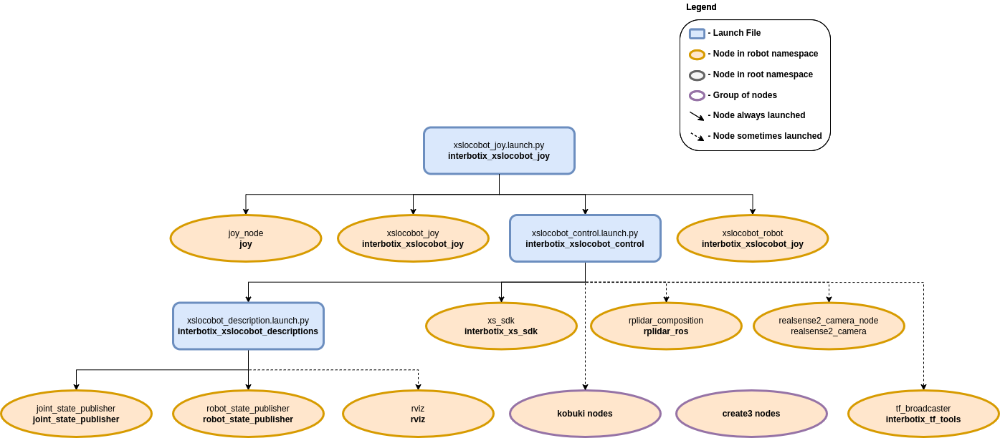

================
Joystick Control
================

.. raw:: html

  <a href="https://github.com/Interbotix/interbotix_ros_rovers/tree/rolling/interbotix_ros_xslocobots/examples/interbotix_xslocobot_joy"
    class="docs-view-on-github-button"
    target="_blank">
    
      View Package on GitHub
  </a>

Overview
========

This package can be used to control the movements of any rover in the Interbotix X-Series LoCoBot
Family using a SONY PS3 or PS4 controller via Bluetooth. In this demo, the 'arm' (if equipped) and
'pan/tilt' servos work in 'position' control mode, the gripper operates in 'PWM' mode, and the base
operates in 'velocity' control mode. Refer to the joystick button map below to see how to operate
the robot. Specifically, some of the joystick controls manipulate individual joints while others
are used to perform 'inverse kinematics' on all the joints to get the end-effector of the robot
(defined at 'ee_gripper_link') to move as if it's in Cartesian space. This is done using the
`modern_robotics`_ code library offered by Northwestern University.

.. _`modern_robotics`: https://github.com/NxRLab/ModernRobotics/tree/master/packages/Python

Structure
=========

As shown above, the `interbotix_xslocobot_joy` package builds on top of the
`interbotix_xslocobot_control` package. To get familiar with the nodes in the
`interbotix_xslocobot_control` package, please look at its README. The other nodes are described
below:

-   **joy** - a ROS driver for a generic Linux joystick; it reads data from a SONY PS3 or PS4
    controller joystick over Bluetooth and publishes `sensor_msgs/Joy`_ messages to the
    ``/<robot_name>/commands/joy_raw`` topic
-   **xslocobot_joy** - responsible for reading in raw `sensor_msgs/Joy`_ messages from the
    ``/<robot_name>/commands/joy_raw`` topic and converting them into `LocobotJoy`_ messages; this
    makes the code more readable and allows users to remap buttons very easily later. The new
    messages are then published on the ``/<robot_name>/commands/joy_processed topic``.
-   **xslocobot_robot** - responsible for reading in `LocobotJoy`_ messages from the
    ``/<robot_name>/commands/joy_processed`` topic and publishing joint, gripper, and pan/tilt
    commands to the **xs_sdk** node; while the 'waist' joint is directly controlled via the PS3/PS4
    joystick, other buttons allow position-ik to be performed using all the arm joints. It also
    publishes velocity commands to the Kobuki base.

.. _`sensor_msgs/Joy`: http://docs.ros.org/latest/api/sensor_msgs/html/msg/Joy.html
.. _`LocobotJoy`: https://github.com/Interbotix/interbotix_ros_core/blob/rolling/interbotix_ros_xseries/interbotix_xs_msgs/msg/LocobotJoy.msg

.. _ros2-joystick-control-usage-label:

Usage
=====

After pairing your Bluetooth joystick controller using the :doc:`Pairing Your Controller
<../getting_started/pairing_controller>` Guide, type the following in a terminal (let's say to
control the locobot_wx200 robot with no lidar):

.. code-block:: console

    $ ros2 launch interbotix_xslocobot_joy xslocobot_joy.launch.py robot_model:=locobot_wx200

A red error message might appear in the screen saying ``Couldn't open joystick force feedback!``.
This is normal and will not affect the joystick operation. To further customize the launch file at
run-time, look at the table below:

.. csv-table::
    :file: ../_data/joystick_control.csv
    :header-rows: 1
    :widths: 20, 60, 20

.. _`xslocobot_joy.launch`: https://github.com/Interbotix/interbotix_ros_rovers/blob/rolling/interbotix_ros_xslocobots/examples/interbotix_xslocobot_joy/launch/xslocobot_joy.launch.py

To understand how the joystick buttons map to controlling the robot, look at the diagram and table
below:

.. image:: images/ps3.jpg

Base Control Mode
-----------------

.. csv-table::
    :file: ../_data/joystick_base_control_mode_ros2.csv
    :header-rows: 1
    :widths: 10, 50
    :align: center

Arm Control Mode
----------------

.. csv-table::
    :file: ../_data/joystick_arm_control_mode_ros2.csv
    :header-rows: 1
    :widths: 10, 50
    :align: center

Both Modes
----------

.. csv-table::
    :file: ../_data/joystick_both_modes_ros2.csv
    :header-rows: 1
    :widths: 15, 96
    :align: center
