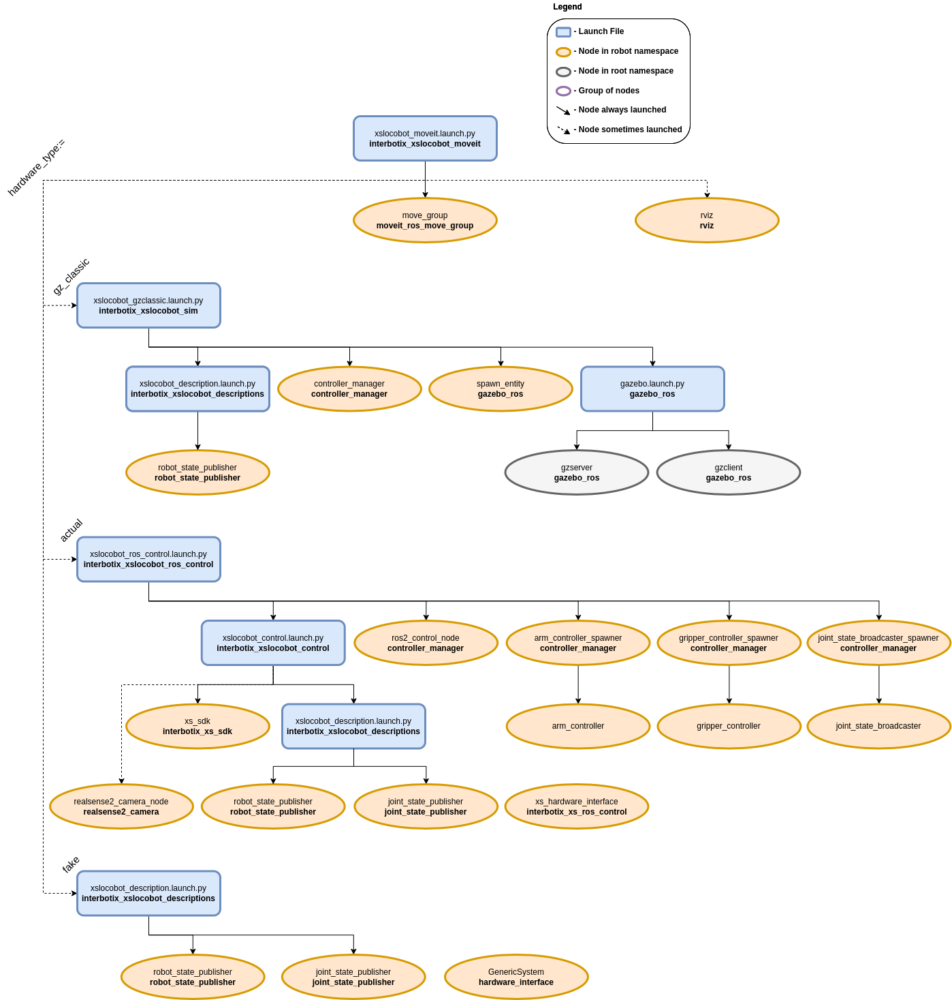

======================================
MoveIt 2 Motion Planning Configuration
======================================

.. raw:: html

    <a href="https://github.com/Interbotix/interbotix_ros_rovers/tree/rolling/interbotix_ros_xslocobots/interbotix_xslocobot_moveit"
        class="docs-view-on-github-button"
        target="_blank">
        
        View Package on GitHub
    </a>

Overview
========

This package contains the necessary config files to get any rover in the Interbotix X-Series
LoCoBot Family working with MoveIt. This package makes use of the FollowJointTrajectory interface
which works well in both simulation and on the physical robot. An entrypoint launch file is
provided to allow a user to choose whether to have MoveIt work with the simulated version, the
physical robot hardware, or a MoveIt-generated mock robot.

Structure
=========

As shown above, this package builds on top of the :doc:`interbotix_xsarm_sim
<simulation_configuration>`, :doc:`interbotix_xsarm_control <locobot_control>`, and
:doc:`interbotix_xsarm_descriptions <locobot_descriptions>` packages. To get familiar with those
packages, please refer to their documentation. Regarding the MoveIt specific nodes, they are
described below:

-   **move_group** - responsible for planning the trajectories needed to achieve a particular
    arm/gripper pose
-   **rviz** - responsible for showing the robot model and including the MoveIt MotionPlanning
    plugin

Usage
=====

To run this package on the physical robot, enter the command below in a terminal (assuming the
'locobot_px100' with no lidar is being launched).

.. code-block:: console

    $ ros2 launch interbotix_xslocobot_moveit xslocobot_moveit.launch.py robot_model:=locobot_px100 hardware_type:=actual

If running this package on a robot simulated in Gazebo Classic, enter the command below in a
terminal (assuming the 'locobot_wx200' with lidar is being launched).

.. code-block:: console

    $ ros2 launch interbotix_xslocobot_moveit xslocobot_moveit.launch.py robot_model:=locobot_wx200 use_lidar:=true hardware_type:=gz_classic

If running this package on a MoveIt generated mock robot, enter the command below in a terminal
(assuming the 'locobot_wx250s' with no lidar is being launched).

.. code-block:: console

    $ ros2 launch interbotix_xslocobot_moveit xslocobot_moveit.launch.py robot_model:=locobot_wx250s hardware_type:=fake

This is the bare minimum needed to get up and running. Take a look at the table below to see how to
further customize with other launch file arguments.

.. csv-table::
    :file: ../_data/xslocobot_moveit_ros2.csv
    :header-rows: 1

Notes
=====

Once the MoveIt GUI is fully loaded, take a look at the available planning groups. There should be
two of them - one called 'interbotix_arm' and the other called 'interbotix_gripper'. The
'interbotix_arm' group contains the joints needed to plan the trajectories for the whole arm
(excluding the gripper) while the 'interbotix_gripper' group contains the joints needed to plan the
trajectories for the gripper (based on the linear distance from the 'right_finger_link' to the
'fingers_link'). There are a few saved poses for each of these groups that be executed such as
'Home', 'Sleep', and 'Upright' poses for the 'interbotix_arm' group, and 'Released', 'Grasping',
and 'Home' for the 'interbotix_gripper' group ('Home' just moves the gripper such that the angular
position of the motor is at 0 radians). Also, it should be noted that the gripper frame of
reference is located at the 'ee_gripper_link'.

Additionally, by default, the MoveIt GUI does not display the green or orange robots that represent
the start and goal states for the arm respectively. To display them, navigate to the
**MotionPlanning -> Planning Request** dropdown in RViz and check the **Query Start State** and
**Query Goal State** checkboxes.
